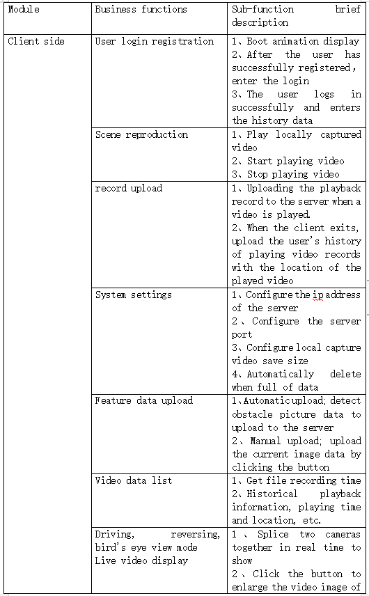
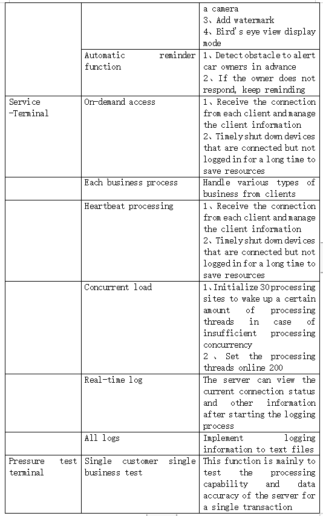
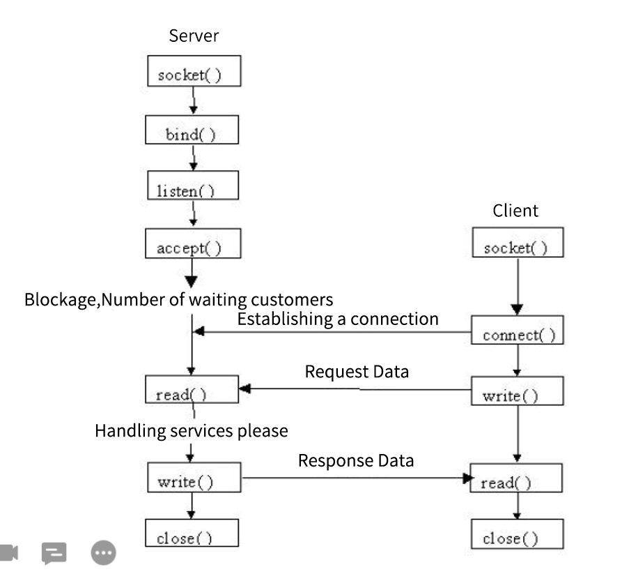
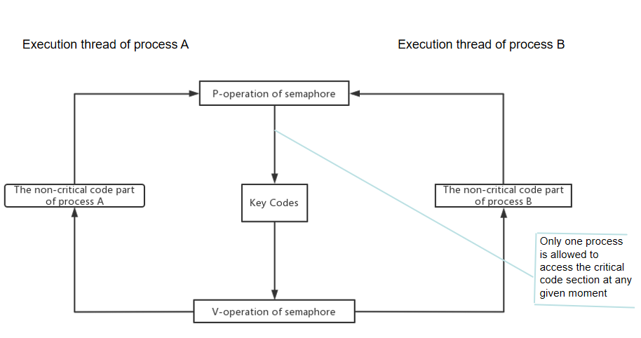

# 1.编写目的

本项目建立在《5G物联网机器视觉开发》相关知识体系的基础上

本文档从功能需求的角度，在以知识体系全面应用的目标为指导下，详细了描述了项目开发的功能需求及功能约束内容，为项目实战的人员和评测团队提供一个详细的功能需求说明文档。

开发者：洪惠雯

用户：想要了解本系统的用户

# 2.项目背景

​	360度智能行车辅助系统是实现了一款基于RTSP流媒体360度智能行车辅助系统、opencv智能驾驶辅助系统，该种智能驾驶辅助系统能够通过安装在车身前后左右的2~4个摄像头，同时采集车辆四周的影像，经过已有的图像处理技术对图像进行畸变还原—视角转化—图像拼接—图像增强等处理，最终形成一幅无缝完整的车周全景鸟瞰图。车辆上使用该系统之后，驾驶员通过配合标尺线能够准确读出障碍物的位置和距离。该项目由设备客户端、终端服务器、大并发压力测试程序三大部分构成，项目综合了《5G物联网视觉开发》和《Linux基础开发》的知识体系；采用大并发通信框架思想和自定义协议，基于TCP Socket封装了包含通信组件、动态数组以及线程池等技术的通信框架。以及基于FFMpeg的媒体数据的编解码功能。项目采用团队开发模式，不仅在项目实战中应用技术，积累项目经验又积累了团队配合的经验。

 

# 3.用途

业务功能主要包含以下几块内容：

 

# 4.运行环境

## 4.1硬设备

处理器：CORE i5-8th

内存：8G

设备：键盘,鼠标

## 4.2支持软件

操作系统：Windows 10，64位

程序语言：C++语言

开发软件***\*:\**** QT 5.9.8、vistual 2019

# 5.系统操作说明

## 服务器模块

1.服务器业务所需文件以及存放路径：

（1）虚拟机/opt下创建两个文件夹：Picture、Video；

（2）服务器存放图片路径（绝对路径）：/opt/Picture；

（3）服务器存放视频路径（绝对路径）：/opt/Video；

（4）Third.db数据库文件存放路径：/opt下即可;

（5）图片传输测试图片：32.png、test.png放在/opt下。

2.服务器启动：

（1）先运行前置服务器Third_Project.out；

（2）运行后置服务器Rear_Server.out。

3.服务器启动：

（1）服务器端口号为8888

（2）默认账户：

| UID  | UAccount | UPWD   |
| ---- | -------- | ------ |
| 1    | admin    | admin  |
| 2    | root     | 123456 |
| 3    | cqs      | 123456 |

 

（3）前后置都设有线程池和共享内存，线程池最多可以开100个线程，共享内存一块开一个协议体数据包的大小，一共开100一百块并设有索引区，读写之后自动偏移到下一块区域，到达最大值时自动偏移到第0个共享内存区域。	

## 客户端模块

该客户端只是个demo，用来测试服务器功能

详细流程见Used tip file文件里头的服务器功能录屏.mp4

# 5.关键技术点

## 5.1.线程与进程

因为在本项目中，有涉及到相当多的进程与线程的应用，所以我本人在这里对这个概念进行一下自我理解描述
”**进程是资源分配的最小单位，线程是CPU调度的最小单位“**这句话我的理解是：

做个简单的比喻：进程=火车，线程=车厢

- 线程在进程下行进（单纯的车厢无法运行）

- 一个进程可以包含多个线程（一辆火车可以有多个车厢）

- 不同进程间数据很难共享（一辆火车上的乘客很难换到另外一辆火车，比如站点换乘）

- 同一进程下不同线程间数据很易共享（A车厢换到B车厢很容易）

- 进程要比线程消耗更多的计算机资源（采用多列火车相比多个车厢更耗资源）

- 进程间不会相互影响，一个线程挂掉将导致整个进程挂掉（一列火车不会影响到另外一列火车，但是如果一列火车上中间的一节车厢着火了，将影响到所有车厢）

- 进程可以拓展到多机，进程最多适合多核（不同火车可以开在多个轨道上，同一火车的车厢不能在行进的不同的轨道上）

- 进程使用的内存地址可以上锁，即一个线程使用某些共享内存时，其他线程必须等它结束，才能使用这一块内存。（比如火车上的洗手间）－"互斥锁"

- 进程使用的内存地址可以限定使用量（比如火车上的餐厅，最多只允许多少人进入，如果满了需要在门口等，等有人出来了才能进去）－“信号量”

## 5.2.进程间通信IPC技术

### 5.2.1技术概述

因为在本项目中，涉及到许多进程间通信的技术，所以本人在这里写一些技术的概述；

进程间通信有如下一些目的：
数据传输：一个进程需要将它的数据发送给另一个进程，发送的数据量在一个字节到几兆字节之间。
共享数据：多个进程想要操作共享数据，一个进程对共享数据的修改，别的进程应该立刻看到。
通知事件：一个进程需要向另一个或一组进程发送消息，通知它（它们）发生了某种事件（如进程终止时要通知父进程）。
资源共享：多个进程之间共享同样的资源。为了作到这一点，需要内核提供锁和同步机制。
进程控制：有些进程希望完全控制另一个进程的执行（如Debug进程），此时控制进程希望能够拦截另一个进程的所有陷入和异常，并能够及时知道它的状态改变。

现在linux使用的进程间通信方式：
（1）管道（pipe）和命名管道（FIFO）
（2）信号（signal）
（3）消息队列
（4）共享内存
（5）信号量
（6）套接字（socket）

这里着重介绍一下socket与信号量

#### socket

linux中的网络编程通过socket接口实现。Socket既是一种特殊的IO，它也是一种文件描述符。一个完整的Socket 都有一个相关描述{协议，本地地址，本地端口，远程地址，远程端口}；每一个Socket 有一个本地的唯一Socket 号，由操作系统分配。

#### 信号量

Dijkstra提出的“信号量”概念是共发程序设计领域的一项重大进步
信号量是一种变量，它只能取正整数值，对这些正整数只能进行两种操作：等待和信号
用两种记号来表示信号量的这两种操作：
	P（semaphore variable） 代表等待 -1
	V（semaphore variable） 代表信号  +1

##### 信号量的分类

最简单的信号量是一个只能取“0”和“1”值的变量，也就是人们常说的“二进制信号量”
可以取多种正整数值的信号量叫做“通用信号量”
假设我们有一个信号量变量sv，则pv操作的
定义如下
P(sv)：如果sv的值大于零，就给它减去1；如果sv的值等于零，就挂起该进程的执行
V(sv): 如果有其他进程因等待sv变量而被挂起，就让它恢复执行；如果没有进程因等待sv变量而被挂起，就给它加1

##### PV操作的工作情况

两个进程共享着sv信号量变量。如果其中之一执行了P(sv)操作，就等于它得到了信号量，也就能够进入关键代码部分了。
第二个进程将无法进入关键代码，因为当它尝试执行P(sv)操作的时候，它会被挂起等待一个进程离开关键代码并执行V(sv)操作释放这个信号量
每一个信号量函数都能对成组的通用信号量进行操作，自然也可以完成对最简单的二进制信号量的操作
还经常需要用到头文件<sys/types.h>和<sys/ipc.h>

信号量语义扩展：

有一间汽车租赁公司共有10辆汽车,同时可以接受10个客户每个客户一辆车的订单。如第11个客户前来租赁,那么就必须等待前面10个客户中任意一个归还汽车后才能租赁，在这之前必须一直等待

汽车租赁公司是个服务器程序,而客户是个客户端程序
服务器程序共掌握有10个资源，同时可以被10个客户端程序防问
利用信号量知识，我们初始化信号量时为信号量赋予10而不是1（不使用二进制信号量）
每个客户端获得资源之后用信号通知服务器，服务器接收到信号后把现有资源数量显示于屏幕中
